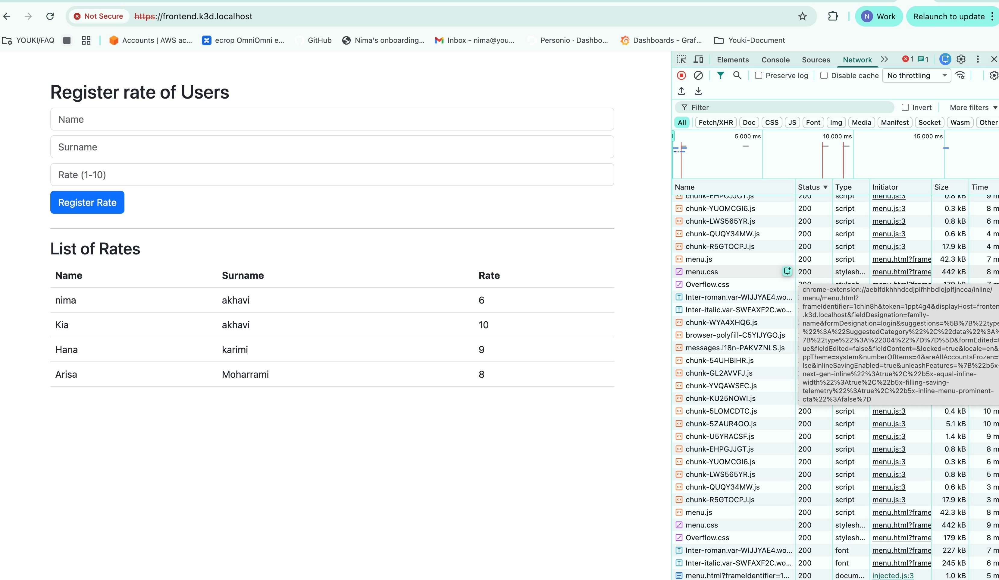

# Vyking Project – Local Installation Guide  
*k3d · Terraform · Argo CD · Helm*

This document describes step by step how to install and deploy the **Vyking project** on a local Kubernetes cluster using **k3d**, **Terraform**, and **Argo CD**.  
The setup follows a GitOps approach where Argo CD continuously syncs infrastructure and applications from GitHub.

---

## Prerequisites

Make sure the following tools are installed on your machine:

- Docker
- kubectl
- k3d
- Terraform **v1.14.3**
- Helm (used internally by Terraform)
- Git

Verify tools:

```bash
docker --version
kubectl version --client
k3d version
terraform version
'''
Step 1: Create a Local Kubernetes Cluster with k3d
Create a Kubernetes cluster named mycluster with one server and two agents, and expose HTTP/HTTPS ports via a load balancer.

bash'''
Copy code
k3d cluster create mycluster \
  --api-port 6550 \
  -p "80:80@loadbalancer" \
  -p "443:443@loadbalancer" \
  --agents 2
  '''
Notes
The cluster name must be remembered, as it will be required later in Terraform variables.

If you already have multiple clusters, this name helps Terraform select the correct Kubernetes context.

Step 2: Configure Local Domain Resolution
Add the frontend domain to your /etc/hosts file so it resolves locally.


127.0.0.1 frontend.k3d.localhost
This allows access to the frontend application via a friendly domain name.

Step 3: Clone the Vyking Repository
Clone the project repository from GitHub and move into the project directory.

bash'''

git clone https://github.com/nimanisha/vyking.git
cd vyking
Step 4: Install Terraform (v1.14.3)
Install the required Terraform version.

Example (Linux)
bash
Copy code
wget https://releases.hashicorp.com/terraform/1.14.3/terraform_1.14.3_linux_amd64.zip
unzip terraform_1.14.3_linux_amd64.zip
sudo mv terraform /usr/local/bin/
'''
Verify:

bash'''

terraform version
Expected output includes:
'''

Terraform v1.14.3
Step 5: Initialize Terraform
Navigate to the Terraform directory and initialize the working directory.

bash'''

cd terraform
terraform init
'''
This downloads required providers and prepares Terraform for execution.

Step 6: Provide Required Terraform Variables
Terraform will prompt for three on-demand variables:

1. Cluster Name
Value must match the k3d cluster name created earlier.

Example:
mycluster

Used by Terraform to select the correct Kubernetes context.

2. GitHub Token
A GitHub Personal Access Token (PAT).

Must have permission to pull images from GitHub Packages (private container registry).

Required for backend and frontend image pulls.

3. Database Password
Arbitrary password of your choice.

Used to configure the PostgreSQL database.

Should be kept secret and not committed to Git.

Step 7: Terraform Plan (Phase 1)
Run Terraform plan with phase 2 disabled.

bash'''
Copy code
terraform plan --var=deploy_phase2=false
'''
This step validates:

Kubernetes connectivity

Variable values

Terraform resources

No changes are applied yet.

Step 8: Terraform Apply (Phase 1)
If the plan succeeds, apply the configuration:

bash'''
 
terraform apply --var=deploy_phase2=false
(Optional, non-interactive):
'''
bash'''
terraform apply --var=deploy_phase2=false --auto-approve
'''
What Terraform Does in This Phase
Creates required Kubernetes namespaces

Creates Kubernetes secrets

Installs Argo CD using a Helm chart

Step 9: Retrieve Argo CD Initial Admin Password
After Argo CD is installed, Terraform outputs the initial admin password.

Retrieve it with:

bash'''
terraform output argocd_initial_password
'''
Use:

Username: admin

Password: output from the command above

This password is required to log in to the Argo CD web interface.

Step 10: Argo CD Applications Deployment
Terraform installs Argo CD Applications as Kubernetes resources.
Three applications are managed by Argo CD:

1. Frontend Application
Deployed using a Helm chart

Supports continuous deployment

Uses versioned Helm releases

Exposed via the load balancer and mapped domain:


frontend.k3d.localhost
2. Backend Application
Deployed using a Helm chart

Version-controlled deployments

Pulls container images from GitHub Packages

Uses Kubernetes secrets for database credentials

3. Infrastructure Application
Deployed using GitHub sync (not Helm)

Responsible for shared and stateful components:

PostgreSQL database

PersistentVolumeClaim (PVC)

CronJob (e.g., scheduled jobs or backups)

Supporting infrastructure resources

This application ensures infrastructure resources remain consistent with the Git repository.

GitOps Flow Summary
Terraform installs Argo CD and initial resources

Argo CD continuously watches the GitHub repository

Any changes committed to Git are automatically synced to the cluster

Infrastructure and applications remain declarative and versioned

Security Notes
Secrets are provided dynamically and should never be committed to Git

For production environments, consider:

Sealed Secrets

Mozilla SOPS

HashiCorp Vault

External Secrets Operator

Cleanup (Optional)
To remove all resources:

bash'''
terraform destroy --auto-approve
Delete the k3d cluster:
'''

bash'''
k3d cluster delete mycluster
'''
Final Result
After completing all steps:

A local Kubernetes cluster is running via k3d

Argo CD is installed and accessible

Frontend, backend, and infrastructure are deployed

## Architecture Diagram


<p align="center">
  
</p>

Continuous deployment is active via Argo CD

