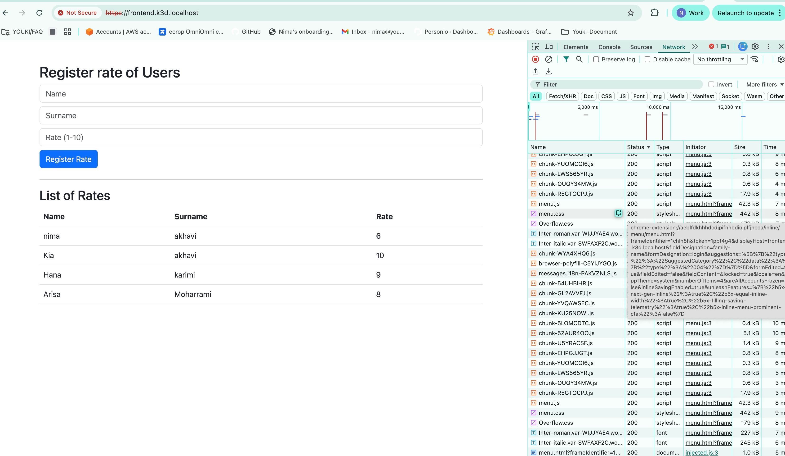

# Vyking Project – Local Installation Guide  
*k3d · Terraform · Argo CD · Helm*

This document describes step by step how to install and deploy the **Vyking project** on a local Kubernetes cluster using **k3d**, **Terraform**, and **Argo CD**.  
The setup follows a GitOps approach where Argo CD continuously syncs infrastructure and applications from GitHub.

---

## Prerequisites

Make sure the following tools are installed on your machine:

- Docker
- kubectl
- k3d  If you don't have **k3d** installed, you can install it using the following commands:

  **For macOS (using Homebrew):**
  ```bash
  brew install k3d
  ```
- Terraform **v1.14.3**
- Helm (used internally by Terraform)
- Git

Verify tools:

```bash
docker --version
kubectl version --client
k3d version
terraform version
```


## Step 1: Configure Local Domain Resolution
Add the frontend domain to your /etc/hosts file so it resolves locally.


127.0.0.1 frontend.k3d.localhost
This allows access to the frontend application via a friendly domain name.

## Step 2: Clone the Vyking Repository
Clone the project repository from GitHub and move into the project directory.

```bash
git clone https://github.com/nimanisha/vyking.git
cd vyking
```
## Step 3: Install Terraform (v1.14.3)
```bash
brew tap hashicorp/tap
brew install hashicorp/tap/terraform
```
you can browse Terraform website for other OS[Terraform Website](https://developer.hashicorp.com/terraform/install)
Install the required Terraform version.


Example (Linux)
```bash
wget https://releases.hashicorp.com/terraform/1.14.3/terraform_1.14.3_linux_amd64.zip
unzip terraform_1.14.3_linux_amd64.zip
sudo mv terraform /usr/local/bin/
```
Verify:

```bash
terraform version
Expected output includes:Terraform v1.14.3

```

## Step 4: Initialize Terraform
Navigate to the Terraform directory and initialize the working directory.

```bash
cd terraform
terraform init
```
This downloads required providers and prepares Terraform for execution.

## Step 5: Provide Required Terraform Variables
Terraform will prompt for three on-demand variables you can provide values in command line --var or you can provide in terraform.tfvar or in meantime of execution:

1. Cluster Name: The k3d cluster name we will create (e.g., mycluster). Used to set the correct Kubernetes context.
Used by Terraform to select the correct Kubernetes context.

2. GitHub Token: A GitHub Personal Access Token (PAT) with permissions to pull images from your private GitHub Packages (GHCR).

3. Database Password or postgres_password: Arbitrary password for the PostgreSQL database. Keep this secure.

4. deploy_phase2: Boolean (true/false) to control the deployment of ArgoCD applications or you can use --target=phase0, 1, 2 in each phases


## Step 6: Create the Cluster (Phase 0)

Create a local Kubernetes cluster named mycluster with one server and two agents, exposing HTTP/HTTPS ports via a load balancer.

In this step create a Local Kubernetes Cluster with k3d

Create a Kubernetes cluster named mycluster with one server and two agents, and expose HTTP/HTTPS ports via a load balancer.

```bash
terraform plan -target=module.phase0
```
**NOTE** You can observe which resource willbe added into infrastructure before apply in next steps I wouldn't mention it but Plan shows us what will be changed in our infra.

```bash
terraform apply -target=module.phase0 --auto-approve
```
#### Notes
The cluster name must be remembered, as it will be required later in Terraform variables.

If you already have multiple clusters, this name helps Terraform select the correct Kubernetes context.

(Optional, non-interactive):
In this step terraform will install sequntialy k3d application and will create 2 worker and 1 master node.

## Step 7: Deploy Core Infrastructure (Phase 1)
```bash
terraform apply --target=module.phase1
```
OR
```bash
terraform apply --var=mdeploy_phase2=flase
```
(Optional, non-interactive):
In this step terraform will install sequntialy these manifests :

1- Namespace

2- Secrets for database , secret for pulling images and make ssl file then creating secret for ssl

3- Then try to install ArgoCD via helm release

4- In this step try to install Istio ingress and Istiod to perform mtls between frontend and backend

5- In next step install Victoria Metrics db vi Helm release

6- In this final step try to install prometheus Adapter to read a custom metric - latency 95.

7- Open telemetry install and configuration to grab the source-label 

8- Kiali install and configured to connect to VM database to grab the mtls configurations.


## Step 8: Deploy Applications via GitOps (Phase 2)
```bash
terraform apply --var=deploy_phase2=true --auto-approve
```
OR
```bash
terraform apply --target=module.phase2 --var=deploy_phase2=true
```
What Terraform Does in This Phase


### What Happens in This Phase?
Argo CD continuously monitors the GitHub repository and deploys the following application stacks using Helm (and Umbrella charts):

Frontend & Backend Applications: Deployed using declarative Argo CD manifests pointing to their respective Helm charts in the repository. They are configured to automatically sync whenever a new commit is pushed.

Secure Database Connectivity: The Backend microservice is dynamically configured to connect to the PostgreSQL database using Kubernetes internal DNS (infrastructure-db-postgresql.db.svc.cluster.local), ensuring no database traffic leaves the cluster.

Zero-Trust Network Policies: Strict Kubernetes NetworkPolicies are applied to the db namespace. This ensures a "Default Deny" posture where only the Backend pods are explicitly whitelisted to communicate with the PostgreSQL database. All other internal or external traffic is blocked at the network level.

Infrastructure Layer: An Umbrella Helm chart that encapsulates our stateful components (PostgreSQL), CronJobs for backups, and telemetry add-ons (OTel and Prometheus Adapter).

## Step 9: Retrieve Argo CD Initial Admin Password
After Argo CD is installed, Terraform outputs the initial admin password.

Retrieve it with:

```bash
terraform output argocd_initial_password
```
Use:

Username: admin

Password: output from the command above

This password is required to log in to the Argo CD web interface.

## Step 10: Argo CD Applications Deployment
With the applications synced and the /etc/hosts file updated, open your browser and navigate to:

http://frontend.k3d.localhost:8443

You should see the Vyking frontend application successfully loaded, confirming the traffic routing through the Istio Ingress Gateway.


## Step 11: Verify Database Backup CronJob
To ensure the postgres-backup CronJob is working and creating backup files on its Persistent Volume, you can trigger it manually and inspect the pod.

```bash
kubectl create job --from=cronjob/postgres-backup manual-backup-1 -n db
```
Exec into the database pod to verify the backup file was created in the shared backup volume (assuming the mount path is /backups):
```bash
kubectl exec -it <postgres-pod-name> -n db -- /bin/sh
ls -lh /backups
exit
```

You should see a .sql or compressed backup archive listed in the directory.
### Infrastructure Application
Deployed using GitHub sync (not Helm)

Responsible for shared and stateful components:

PostgreSQL database

PersistentVolumeClaim (PVC)

CronJob (e.g., scheduled jobs or backups)

Supporting infrastructure resources

This application ensures infrastructure resources remain consistent with the Git repository.

GitOps Flow Summary
Terraform installs Argo CD and initial resources

Argo CD continuously watches the GitHub repository

Any changes committed to Git are automatically synced to the cluster

Infrastructure and applications remain declarative and versioned

Security Notes
Secrets are provided dynamically and should never be committed to Git


<!-- Cleanup (Optional)
To remove all resources:

```bash
terraform destroy --auto-approve
```
or do it phase base:
For revoking phase 2 only:

```bash
terraform destroy --target=module.phase2 --var=deploy_phase2=true
```
Revoking only phase 1:

```bash
terraform destroy --target=module.phase1
```
In most commonn it couldn't revoke namespace so you can proceed
Revoking phase 0 
```bash
terraform destroy --target=module.phase0 -->
<!-- ``` -->
# Core Architectural Components
## 1. Istio Service Mesh & mTLS
Istio acts as our network backbone. By passing traffic through Istio's Envoy sidecar proxies, we automatically enforce mTLS (Mutual TLS) across the cluster.

Zero-Trust Security: Every pod-to-pod communication (e.g., Frontend to Backend, Backend to Database) is cryptographically authenticated and encrypted.

No Code Changes: This security layer is achieved transparently without altering any application code.

## 2. OpenTelemetry (OTel) Metrics Pipeline
Instead of relying on traditional scraping architectures, we use OpenTelemetry as our central telemetry pipeline.

Collection: The OTel Collector actively scrapes raw Prometheus-style metrics directly from Istio's Envoy proxies.

Processing: It processes these metrics, dynamically attaching crucial metadata (like namespace, pod name, and IP addresses) using relabel_configs.

Exporting: Finally, it performs a remote_write to push all processed telemetry data into VictoriaMetrics. This standardizes metric collection and cleanly decouples data scraping from data storage.
## 3. Kiali (Mesh Observability)
Kiali provides a powerful, visual observability console for the Istio Service Mesh.

Visualizing Traffic: It automatically maps the network topology, showing exactly how microservices communicate in real-time.

mTLS Validation: It provides visual confirmation of mTLS enforcement (displaying lock icons on traffic edges).

Health & Tracing: It highlights traffic bottlenecks, HTTP error rates, and validates Istio configurations (like VirtualServices and Gateways) to ensure healthy routing.
# Data Flow:
## How Prometheus Adapter Translates Custom Metrics for HPA:

In my Terraform file, I configured a rules block that defines the exact logic for metric translation. Since Kubernetes (HPA) doesn't understand PromQL or the concept of histogram buckets—it just expects a simple numerical value (e.g., 4 milliseconds)—I set up the Prometheus Adapter to handle this translation in three specific steps:

## 1. Finding the Raw Data (seriesQuery)
```bash
YAML seriesQuery:
'istio_request_duration_milliseconds_bucket'
```

First, I configured the adapter to query VictoriaMetrics to locate all the raw metrics named istio_request_duration_milliseconds_bucket. This represents the raw telemetry data currently being collected by the OTel pipeline.

## 2. Renaming and Reshaping (The name section)
```bash
YAMLname:
  matches: "istio_request_duration_milliseconds_bucket"
  as: "istio_requests_latency_p95"
  ```
This is where I mapped the metric renaming:

matches: Tells the adapter to look for the raw metric name in the database.

as: Instructs the adapter to expose this metric to the Kubernetes API (custom.metrics.k8s.io) under a custom name: istio_requests_latency_p95.

By doing this, when I reference istio_requests_latency_p95 in my HPA configuration, the adapter automatically links it back to the underlying Istio metric in the database.

## 3. Real-time Mathematical Calculation (metricsQuery)
```bash
YAMLmetricsQuery: "(histogram_quantile(0.95, sum(rate(<<.Series>>{<<.LabelMatchers>>}[2m])) by (le, <<.GroupBy>>)) >= 0) ... "
```
Since raw bucket data consists of simple counters, it doesn't hold any direct scaling value on its own. I set up the metricsQuery so that when the HPA asks, "What is the value of istio_requests_latency_p95?", the adapter dynamically constructs this PromQL formula and sends it to VictoriaMetrics.

It uses dynamic variables (templates) like <<.Series>>. In real-time, the adapter replaces <<.Series>> with istio_request_duration_milliseconds_bucket, calculates the 95th percentile (p95), and ultimately hands over a single, pure number to the HPA.

## 🗺️ Workflow Summary
To summarize the complete metric naming and scaling flow I built:

### Envoy / OTel / VictoriaMetrics: 
These components generate, collect, and store the data using the actual raw name: istio_request_duration_milliseconds_bucket.

### Prometheus Adapter:
 Reads this raw data, applies my mathematical formula (histogram_quantile 0.95), and packages the resulting value under the new label: istio_requests_latency_p95.

### HPA:
 Only interacts with the translated name istio_requests_latency_p95. It makes Scale Up or Scale In decisions based purely on the calculated number provided by the adapter.


# Final Result:


After completing all steps:

A local Kubernetes cluster is running via k3d

Argo CD is installed and accessible

Frontend, backend, and infrastructure are deployed

## Architecture Diagram


<p align="center">
  
</p>

Continuous deployment is active via Argo CD

